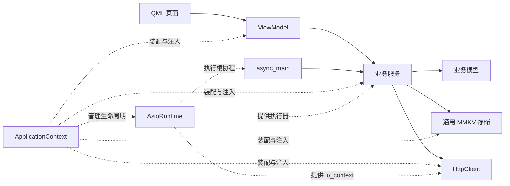

# 架构设计

本文解释模板的职责与生命周期；执行规则见 [AGENTS.md](../AGENTS.md)，环境配置和构建命令见 [README.md](../README.md)。

## 分层与依赖

| 位置 | 逻辑模块 | 职责 | Qt 依赖 |
| --- | --- | --- | --- |
| `errors/` | `Template.Errors` | Rust 风格的 Result、Error、From 转换与 Exception | 无 |
| `models/task/` | `Template.Models` | 任务记录、校验与业务错误码 | 无 |
| `storage/` | `Template.Storage.Mmkv` | 通用键值读写、存储错误、句柄管理 | 无 |
| `network/` | `Template.Network.Http` | 基于 cofetch 与 libcurl 的 HTTP 请求、传输错误、退出时中止请求 | 无 |
| `services/taskservice/` | `Template.Tasks` | 任务编解码、状态提交、协程业务接口 | 无 |
| `services/taskimportservice/` | `Template.Tasks.Import` | 读取远程任务、用 glaze 解析 JSON | 无 |
| `runtime/` | `Template.Runtime.Asio`、`task.h` | io_context、work guard、后台线程；头文件定义 `Task`、`Executor` 协程词汇 | 无 |
| `app/asyncmain/` | `Template.App.AsyncMain` | 应用初始化、等待退出、清理编排 | 无 |
| `viewmodels/` | `Template.ViewModels.Task`、`Template.ViewModels.TaskList`、`async/spawn.h` | 标准库与 Qt 类型转换、可观察界面状态、在 Qt 侧启动任务 | 有 |
| `app/applicationcontext/` | `Template.App.Context` | 装配运行时、存储、服务、生命周期和 ViewModel | 有 |
| `ui/`、`app/main.cpp` | QML 与 Qt 入口 | 页面、类型注册、根组件注入、GUI 事件循环 | 有 |

`template_core` 包含前八行，`template_gui` 包含 ViewModel、ApplicationContext、QML 注册和资源。`app/asyncmain` 自动收集进 core，并从 gui 的 app 文件集合中排除。业务依赖具体的 MMKV、Asio、cofetch 与 glaze，不引入 Repository、Runtime、HTTP 虚接口或后端工厂。

Qt 类型止于 ViewModel 适配边界及外侧的 UI、装配和启动代码。业务模型、存储、网络、服务、运行时和 async_main 使用标准库与 Asio 类型。Qt 侧通过 `viewmodels::spawn` 启动任务，结果排队回 GUI 线程，QObject、Qt 列表模型及可观察状态仅在该线程修改。

## 源码与命名模块

业务、ViewModel 和应用模块按模块建立子目录，接口、实现与可选分区位于同一目录，允许多个实现文件。`storage/{mmkv.cppm,mmkv.cpp}`、`network/{httpclient.cppm,httpclient.cpp}` 与 `runtime/{asioruntime.cppm,asioruntime.cpp}` 直接使用分层目录。第三方 SDK 的头文件放在私有实现分区：`storage` 的 `:sdk`（MMKV）、`network` 的 `:sdk`（cofetch 与 libcurl）、`Template.Tasks.Import` 的 `:json`（glaze）。分区的全局模块片段只包含第三方与所需标准库头文件，不 `import std`，主接口不导出分区。

逻辑名称由 `export module` 决定，文件移动不改变 import 名称。CMake 按分层自动发现源码，模块接口加入公开的 `CXX_MODULES` 文件集，由 Ninja 调用 clang-scan-deps 扫描 import 依赖；额外库依赖在 `cmake/Dependencies.cmake` 显式声明。每个模块的 BMI 由声明它的目标编译一次，其他目标共享。Clang 默认生成精简 BMI，只保留模块引用的全局模块片段声明，因此导出模板在导入方实例化时才按 ADL 查找的实体要在模块内显式引用，例如 `asyncmain.cppm` 的 `channelError` 保留 Asio 通道错误码的 `make_error_code` 与 `is_error_code_enum` 特化。

统一使用 C++23，可整体切换 C++26。业务通过 `import std;` 使用标准库，用 using 声明与命名空间别名引入需要的名字（`using std::format;`、`using runtime::Task;`、`namespace fs = std::filesystem;`），代码中避免全限定名。局部变量和工厂结果灵活使用 auto / const auto，公共返回契约、数值宽度与资源所有权保持清晰。Qt、Asio、MMKV 的头文件按 SDK 要求接入。

### QObject 与 Modules

ViewModel 和 ApplicationContext 保留 `.cppm`、`.h`、`.cpp` 混合结构：

- `.h` 声明 QObject、Q_OBJECT、Q_PROPERTY 和信号，供 AUTOMOC 与 `qt_add_qml_module` 的 QML_FOREIGN 注册使用；PIMPL 隔开业务模块类型。
- `.cppm` 在全局模块片段包含头文件，通过 `export using` 暴露类，QObject 类仍属于全局模块。
- 普通实现 `.cpp` 不声明命名模块，导入自己的模块取得业务依赖定义。
- Dependencies、Initialization 在头文件中前置声明，定义位于 `.cppm` 的 `extern "C++"` 块；它们保持全局模块归属，同时引用业务模块类型。
- 模块不导出宏。使用 Qt 宏的消费者包含对应 Qt 头文件，注册适配代码直接包含 QObject 头文件。

Task 模块重导出 TaskList 模块。应用与测试使用 `import Template.ViewModels.Task;`。这种组织保留 Qt 的生成与链接流程。[Qt moc](https://doc.qt.io/qt-6.12/moc.html)、[模块归属规则](https://eel.is/c++draft/module.unit#7.2.4)。

## 启动、初始化与退出

### 正常启动

1. main 创建 QGuiApplication，设置应用身份与样式。
2. ApplicationContext 装配 AsioRuntime、MmkvStore、TaskService、Lifecycle 和 TaskViewModel；构造不启动业务加载。
3. QML 引擎接收 appContext，加载根窗口；页面通过 required property 接收具体 ViewModel。
4. main 调用 `context.start()`，再进入 `app.exec()`。start 只接受一次，重复或停止后调用返回 false。
5. ApplicationContext 依次调用已接线 ViewModel 的 initialize()，再用 `viewmodels::spawn` 启动根协程。TaskViewModel.initialize() 设置 busy，接收自己的 `Startup<Update>` 结果任务。
6. async_main 按顺序执行启动步骤：每一步 co_await 服务的加载操作（服务自己切到 strand）并交付结果；ViewModel 在 GUI 线程收到结果，更新列表、ready、busy 和错误信息。根协程随后等待退出通知。

每个启动结果是一个容量为 1 的 Asio concurrent_channel，由 `lifecycle->startup<Result>()` 登记，只交付一次、只有一个消费者；Lifecycle 另用一个通道保存退出通知。`Dependencies` 只含 Lifecycle 与有序的启动步骤，`startup_step(service, &Service::operation, startup)` 把服务操作与其结果绑定，因此 async_main 不认识具体服务，新增功能无需修改 `app/asyncmain`。请求退出时尚未开始的步骤被跳过，所有登记的结果被取消，消费者收到空结果（`nullopt`）而非异常；退出后才登记的结果立即取消。

初始化的存储错误作为业务结果交给界面，页面可调用 reload() 重试，根协程继续等待退出。未处理的根协程异常取消所有启动结果，已交付的结果不受影响，并在 Qt 边界记录错误并请求应用退出。独立构造 ViewModel 时由调用方显式 reload()，应用级首次加载由 async_main 发起。

### 退出与成员销毁

QCoreApplication 的 aboutToQuit 连接到 context.stop()。stop 幂等：先禁止新的界面命令，再中止 HttpClient 进行中的请求并拒绝新请求，然后向 Lifecycle 请求停止；退出早于根协程执行时，初始化被跳过；退出发生在初始化期间时，启动结果等待者被释放，有限的业务操作继续完成。停止后的 Qt 完成处理器忽略界面更新。

外层对象按 QGuiApplication、ApplicationContext、QQmlApplicationEngine 的顺序声明，QML 引擎先析构。ApplicationContext 内部依次持有 AsioRuntime、MMKV 存储、HttpClient、Lifecycle、服务、ViewModel。Impl 析构函数先再次请求停止，再调用运行时 finish()，此时 ViewModel 和服务仍存在；根协程与已接受操作结束、线程 join 后，成员再按相反顺序销毁，Qt application 最后销毁。

因此清理不依赖 GUI 线程处理任何回复，Qt 事件循环结束后也能完成。示例资源由 RAII 释放。HTTP 请求有超时，退出时由 stop() 立即结束，不必等到超时。新增持续任务、定时器或长连接时，所属业务须响应退出请求，取消持续 I/O，并在 async_main 返回前 await 清理完成。

## 错误处理

错误处理集中在 `Template.Errors`（`src/errors/errors.cppm`），模仿 Rust 的 `Result`、`?`、`From` 与 anyhow 的 `context`。各层（business、storage、network、application）只保留自己的 `enum class ErrorCode`，`Error`、`Result<T>`、`Exception` 都是共享模板的别名：

- `errors::Error<Code>` 是 `{code, detail}`，`detail` 由外向内带上下文，`.context("外层")` 在前面加上一层。
- `errors::Result<T, Code>` 派生自 `std::expected<T, Error<Code>>`，保留 `std::expected` 的全部成员，并补充 Rust 名字的方法；`Ok(v)`、`Ok()`、`Err(code, 格式串, 参数…)` 构造结果。
- `errors::From<To, From>` 的特化提供错误码映射，`Error<To>` 因此可以从 `Error<From>` 隐式构造；`?`、`Err` 返回与 `and_then` 都借此跨层转换，原有 detail 保持不变。TaskService 定义 storage → business，导入服务定义 network → business。
- `errors::Exception<Code>` 只用于构造失败与违反使用约定；`expect()` 失败时也抛出它。

`?` 借助协程实现：Result 带有 `promise_type`，返回 Result 的函数一旦使用 `co_await` 或 `co_return` 就成为协程，并在调用时立即执行（`initial_suspend` 为 `suspend_never`）。`co_await r` 在 r 成功时直接得到值；失败时把错误（必要时经 From 转换）交给 promise，协程停在原处并返回调用方。Clang 只在协程首次返回调用方时才把 `get_return_object()` 的结果转换为 Result（本项目统一使用 Clang），这时结果已经确定；随后返回对象销毁协程帧，局部变量按正常顺序析构。协程体抛出的异常由 `unhandled_exception` 重新抛给调用方，协程帧由编译器在异常离开首次执行时释放，返回对象此时不再重复销毁。Asio 的 `awaitable` 只接受自己的可等待类型，因此在 `runtime::Task` 协程里对 Result 使用 co_await 会在编译期报错。

服务因此分成两层：异步部分只等待 I/O 与执行器切换，业务逻辑写成同步的 Result 函数。TaskService 的加载、新增、修改、删除都是同步 Result 函数，由公共方法放到 strand 上运行；导入服务的 `fetchTasks` 等待 HTTP 响应，再调用同步的 `importTasks` 校验状态码、解析 JSON。

可恢复的失败沿 Result 返回：MmkvStore 返回 `storage::Result<T>`，HttpClient 返回 `network::Result<Response>`，TaskService 返回 `Task<UpdateResult>`（`business::Result<Update>`），失败时已提交状态不变。ViewModel 收到错误后翻译为界面文案；加载失败另将 ready 置为 false。

`Error::detail` 的例子：`add task: write 'tasks.items' to MMKV store 'app' in '/…/mmkv': the store is open read-only`。存储层给出实例、目录与键，网络层给出方法与 URL（如 `import tasks: GET http://…/tasks: HTTP 503`），服务层加上操作与任务 ID，模型层给出字段、记录序号与偏移。

异常只用于构造失败与违反使用约定，例如缺少服务、执行器或 HTTP 客户端，重复初始化 ViewModel，重复运行 async_main。MMKV SDK 自身的异常在存储边界转为 `storage::Error`，libcurl 的传输错误与取消转为 `network::Error`；不可恢复的异常在 ViewModel 显示为操作失败，在 ApplicationContext 记录后退出应用。

## 执行器与业务状态

AsioRuntime 是具体资源所有者，管理一个 io_context、work guard 和一条后台线程。协程词汇定义在 `runtime/task.h`：`runtime::Task<T>`（`asio::awaitable<T>`）是异步操作的返回类型，`runtime::Executor`（`asio::any_io_executor`）表示协程在哪里运行。用到它们的接口与实现单元在全局模块片段包含这个头文件，与包含其他 Asio 头文件的方式相同；只有需要 AsioRuntime 本身的单元导入运行时模块。服务接收应用注入的执行器，各自用 make_strand 建立 strand，不创建自己的事件循环或线程。

执行器只出现在基础设施里。业务代码像 Rust 的 async fn 一样写：函数返回 `Task<T>`，内部 `co_await` 其他任务，调用方在任何协程里直接 `co_await`。服务的公共方法把操作及其参数连同共享状态交给 `onStrand`，由它用 `co_await co_spawn(strand, …, use_awaitable)` 在自己的 strand 上运行操作；co_spawn 完成时把调用方派回它自己的执行器。TaskService 的操作是同步 Result 函数，导入服务的操作是等待 HTTP 的 `Task` 协程。同一服务的操作按提交顺序在 strand 上执行。业务接口不接收完成回调。从同步代码启动任务只有三处：Qt 侧的 `viewmodels::spawn`（`viewmodels/async/spawn.h`，按 Asio 完成处理器的形式 `(exception_ptr failure, T value)` 把结果投递到 GUI 线程）、ApplicationContext 启动 async_main，以及测试（用 use_future 或在自己的 io_context 上等待）。

业务状态仅在所属服务的 strand 上访问，MMKV 的同步调用留在后台线程。已创建的协程捕获共享状态，即使服务或 ViewModel 句柄先销毁仍可完成。公共运行时必须活过使用者，停止新提交后由所属线程 finish() 排空操作并 join。[Asio io_context](https://think-async.com/Asio/asio-1.38.2/doc/asio/reference/io_context.html)。

ViewModel 的 Q_INVOKABLE 返回 true 只表示命令已接受。业务先保存候选数据，再提交内存状态；Qt 边界随后更新界面，新增成功才清空输入。保存失败保留已有业务状态、复选框状态和输入内容。

不同任务的命令可以同时进行：服务 strand 依次执行，每个结果都是完整快照，按完成顺序应用到界面。ViewModel 只锁定受影响的部分：保存中的任务在列表模型中标记为 pending，只禁用该行；新增进行中时 adding 锁定输入，保证成功后清空的是已提交的文字；加载替换整个列表，loading 期间拒绝其他命令，加载也要等已接受的命令完成后才开始。busy 表示还有操作进行，只用于进度提示。被拒绝的命令返回 false 并发出 commandRejected(reason)，页面显示短暂提示。

错误按加载、新增、任务 ID 分别保留，errorMessage 汇总尚未解决的错误。成功只清除该目标的错误：新增重试成功清除新增错误，某行更新或删除成功清除该行错误，加载成功清除加载错误。其他任务的成功不会隐藏失败；多个目标失败时，可以分别重试并逐项清除。任务一旦不在新应用的快照中（例如对已不存在的任务报出 notFound），就无法再针对它取得成功，它的错误在下一次列表更新时清除。

## 通用 MMKV 后端

MmkvStore 不导入业务模型，公共 API 使用标准库类型与独立的 storage::Error。SDK 头文件集中在 mmkv_sdk.cppm 的全局模块片段；该文件声明私有实现分区 Template.Storage.Mmkv:sdk，存储实现通过 import :sdk 使用其声明。分区不会从主接口导出，SDK 的宏与 TU-local 操作留在分区内部，保持原生 C++ 链接、SDK 类型的全局模块归属与 include-before-import 顺序，也避免 clangd 合并 SDK 头文件与标准库模块时出现类型歧义。Ninja 的模块依赖扫描同时跟踪实现分区，修改它时会使导入它的模块单元重新编译。

后端负责键值读写、文件完整性、操作锁、同步与句柄生命周期。打开前完整校验 CRC，避免 MMKV 默认恢复丢弃数据；之后的访问比较数据与元数据文件的大小和修改时间，发现外部改动时重新完整校验。TaskService 负责 tasks.items 键、记录编解码、业务校验与错误转换。任务示例使用原生字符串列表，每条记录按 ID、标题、完成标记排列。

getter 返回 expected<optional<T>, storage::Error>，区分缺失键、空值与读写错误。MMKV 没有逐键类型标签，调用方使用匹配的 setter/getter；业务之间通过具名键或独立实例隔离。相同目录与实例 ID 共享句柄和操作锁，最后一个引用释放时关闭。

写入成功按 SDK set 的返回值判断，sync 返回 void，模板不把它视为可检测的断电持久性确认。存储与业务测试使用真实 MMKV 临时实例，不引入可替换存储接口。持久化不使用 JSON，模板不包含历史格式兼容或数据迁移；多进程、加密配置和运维策略由使用模板的应用按需求接入。

## HTTP 与 JSON

`network::HttpClient` 是 cofetch 的薄封装，cofetch 用 libcurl 的 multi 接口在 Asio 的 io_context 上完成传输。cofetch 不是线程安全的，Client 与 io_context 须在同一线程，完成时直接调用处理器而不派发到调用方的执行器。HttpClient 因此在构造时接收 AsioRuntime 唯一的 io_context（`AsioRuntime::context()`），每个请求先 co_spawn 到 io_context 上执行，完成后由 co_spawn 把调用方派回它自己的执行器：服务协程 `co_await http->get(url)` 后仍在自己的 strand 上。传输失败（DNS、连接、TLS、超时）与取消返回 `network::Error`；任何 HTTP 状态都作为 `Response` 返回，由服务决定可接受的状态。

请求与 `stop()` 的取消信号竞争：stop 在 io_context 上取消一个永不到期的定时器，进行中的请求随即以 `cancelled` 结束，之后的请求直接被拒绝；取消等待请求的协程同样会中止传输。ApplicationContext 创建共享 HttpClient 并在 stop() 中调用它，因此退出不必等待请求超时。进行中的请求持有客户端状态；HttpClient 的句柄若在运行时仍在运行时销毁，cofetch 的清理会被投递到运行时线程。

`business::TaskImportService` 演示服务如何使用两者：注入 HttpClient，GET 一个 `[{"title": "...", "completed": false}, ...]` 形式的 JSON，由 `:json` 分区用 glaze 解析（忽略其他字段），再规范化标题、生成本地 ID，返回不落盘的任务记录。HTTP 状态非 2xx、JSON 格式错误、标题无效分别返回 `network`、`invalidFormat`、`invalidTitle`，上下文为 `import tasks: GET <url>: …`。模板不改界面，把导入的任务保存或展示由使用模板的应用接入。

libcurl 在 macOS 使用系统 SDK 自带的库，在 Linux 使用发行版的 libcurl，在 Windows 由 CMake 从固定版本的源码静态构建并使用系统的 Schannel TLS。网络测试在测试进程内启动回环 HTTP/1.1 服务，覆盖状态码、请求体、跨执行器恢复、连接失败、超时、取消、stop 与客户端提前销毁，不访问外网。

## 扩展业务与 ViewModel

1. 在 models / services 下添加业务模块与返回 `runtime::Task` 的协程接口，服务用应用注入的执行器建立自己的 strand；存储通过具名键或独立 MMKV 实例使用，远程数据通过注入的共享 HttpClient 获取。源码由 CMake 自动发现。
2. 添加 ViewModel 模块目录、QObject 头文件、导入入口与实现；Dependencies 只列出所需服务与 `runtime::Executor`，命令通过 `viewmodels::spawn` 启动并在 GUI 线程接收结果。需要应用级初始化时定义 `Initialization{result}` 与 `initialize()`、`stop()`，结果类型与服务的启动操作一致。
3. 在 ApplicationContext::Impl 依次声明服务与 ViewModel 成员（context 为应用级 ViewModel 的 QObject 父对象），并在构造函数中调用一次 `attach(viewModel, service, &Service::operation)`；启动步骤、初始化、退出与析构顺序由它统一处理，`app/asyncmain` 无需修改。不需要启动加载的 ViewModel 调用 `attach(viewModel)`，只登记退出时的 `stop()`。
4. 给 ApplicationContext 增加强类型只读 Q_PROPERTY，在 ui/qmltypes.h 添加 QML_FOREIGN / QML_NAMED_ELEMENT / QML_UNCREATABLE 注册；main 保持统一的 appContext 注入。
5. 根组件将具体 ViewModel 传给页面，页面声明 required property；新增 QML 文件由 `qt_add_qml_module` 自动收集进资源、qmldir、qmllint 与 qmlcachegen；文件平铺在 `/qt/qml/Template/Ui` 下，因此 QML 文件名在 src/ui 内唯一。`Template.Ui` 构建为静态插件，应用与 QML 测试通过 `Q_IMPORT_QML_PLUGIN(Template_UiPlugin)` 导入。
6. 按改动验证 C++23/26、受影响的业务与 ViewModel/QML 测试、qmllint、clangd；涉及业务边界时检查无 Qt 构建。验证要求见 [AGENTS.md](../AGENTS.md#验证与编辑器)。

同一份界面状态复用同一个 ViewModel；页面需要独立状态时，由对应作用域创建、持有并注入共享服务。类型注册与实例装配分开，QML 不直接创建应用持有的实例。[Qt 注册宏](https://doc.qt.io/qt-6/qqmlintegration-h.html#QML_UNCREATABLE)。
